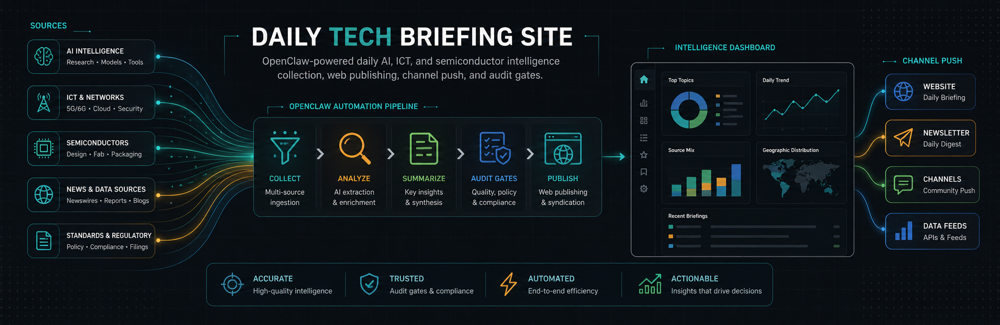

# 每日科技信息站

当前版本：`1.1.4`

英文首页：[README.md](README.md)

每日科技信息站是一个本地优先的“定时资讯采集结果网页发布层”。上游由 OpenClaw 负责采集 AI、ICT、半导体相关新闻、视频、公众号和 Builder 动态；本项目负责把生成后的 Markdown 日报发布为网页、接收反馈、生成反馈汇总，并通过绑定 channel 做可选推送和巡检回执。

公开包不包含任何真实 token、个人路径、运行缓存或私有资讯源归档。使用者需要自己配置日报目录、反馈目录、维护 token、推送 channel、Cloudflare Tunnel token 和 OpenClaw 采集环境。

## 2026-06-03 修订

- 推荐的 Tunnel 发布链路调整为用户级 `http2` connector，并优先采用固定 Cloudflare edge IP，减少 `argotunnel` SRV 发现不稳定导致的公网发布抖动。
- `10:15` 健康回执现在会区分“当前已安装 OpenClaw 版本”和“最近自动统一升级回执”，避免把历史自动升级版本误读成当前运行版本。
- `run-feedback-health-report.sh` 会优先从当前 OpenClaw cron 合同中回填 `FEISHU_TARGET`，降低因环境变量缺失导致健康状态文件误报失败的概率。
- 上游采集侧 Juya YouTube 必收源新增 `youtube-feed -> yt-dlp` fallback，适用于上午版 required source 检查。

## 2026-06-04 运营合同

- 参考生产合同改为 morning-only：`09:40` 上午采集，`10:15` 反馈与健康回执。
- 下午版和晚间版采集/刷新默认关闭，除非显式 opt in，否则 installer 不安装。
- morning refresh 默认 36 次、每 10 分钟一次，用于追踪晚到日报。
- launchd live 服务读取 `~/Library/Application Support/daily-tech-site/cache`；项目 `.cache` 只用于本地/手动运行。

## 项目目的

本项目的目标是把“每天看大量科技资讯”变成一个可运行、可巡检、可替换源、可开源协作优化的系统：

- 从分层来源采集 AI、ICT、云、数据中心、芯片、半导体、端侧智能和企业 AI 工程化信号。
- 将每日快照发布为稳定的网页阅读体验。
- 通过配置好的 channel 推送重要更新。
- 让反馈、维护日志、刷新检查、隐私检查和排期门禁都可审计。
- 让使用者可以替换源池、增加新闻源、调整采集时间、定制推送次数，并共同优化链路。

## 范围

这个仓库是可开源的“网页发布 + 反馈 + 缓存 + 推送 + 巡检门禁”包。它本身不是完整爬虫全集；完整采集能力依赖 OpenClaw 及其插件、脚本和源相关工具。

更详细的产品逻辑、依赖矩阵、源头分层、fallback 顺序、模型链路和 OpenClaw 依赖请看：

- [OpenClaw 采集与产品逻辑](docs/openclaw-collector-pipeline.md)
- [架构说明](docs/architecture.md)
- [配置说明](docs/configuration.md)
- [部署说明](docs/deployment.md)
- [运维说明](docs/operations.md)

核心链路概览：

```text
OpenClaw 定时采集器
  -> AI / ICT / 半导体 Markdown 日报
  -> 本项目网页缓存和 API
  -> 公开阅读网页
  -> 读者反馈 Markdown
  -> 可选反馈汇总
  -> 可选 OpenClaw channel 推送
  -> 本地健康检查与隐私门禁
```

## 本包功能

- 读取 `NEWS_ARCHIVE_DIR` 中的定时日报 Markdown。
- 构建网页缓存，提供稳定阅读体验。
- 提供主站网页和仅本机可访问的维护页。
- 将读者反馈保存为 Markdown。
- 可通过配置的模型 wrapper 汇总反馈；不配置时使用规则兜底。
- 配置 `FEISHU_TARGET` 后，可通过 OpenClaw Feishu broadcast 推送刷新告警或反馈汇总。
- 提供 macOS launchd 模板。
- 提供隐私、语法、plist、排期合同和 smoke 门禁。

## 快速开始

```bash
cp .env.example .env
npm run build:cache
npm run dev
```

打开：

```text
http://localhost:4321
```

仓库自带一个示例日报，clone 后即使还没有接入自己的 OpenClaw 采集器，也能先跑通网页和反馈链路。

## 配置

生产使用前编辑 `.env`：

```bash
PORT=4321
HOST=0.0.0.0
SITE_TITLE=每日科技信息
FIXED_SITE_URL=http://localhost:4321
NEWS_ARCHIVE_DIR=./data/collections
FEEDBACK_DIR=./data/feedback
FEEDBACK_DIGEST_DIR=./data/feedback/_digest
MAINTENANCE_DIR=./data/maintenance
CACHE_DIR=./.cache
SUMMARIZE_WRAPPER=
OPENCLAW_BIN=openclaw
FEISHU_ACCOUNT=default
FEISHU_TARGET=
MAINTENANCE_TOKEN=replace-with-a-local-maintenance-token
```

生产必填：

- `NEWS_ARCHIVE_DIR`：生成后的 Markdown 日报目录。
- `FEEDBACK_DIR`：读者反馈 Markdown 写入目录。
- `MAINTENANCE_DIR`：运行日志和状态说明写入目录。
- `MAINTENANCE_TOKEN`：维护页和本地维护 API 使用的 token。

可选集成：

- `SUMMARIZE_WRAPPER`：shell wrapper，从 stdin 读取 prompt，在 stdout 返回反馈建议。参考 OpenClaw 环境中通常通过 `summarize-openclaw.sh` 调用 `summarize-pro`。
- `OPENCLAW_BIN`、`FEISHU_ACCOUNT`、`FEISHU_TARGET`：通过 OpenClaw Feishu broadcast 做 channel 推送。其他 OpenClaw channel 可以改造 `src/feishu.js` 接入。
- `.env.tunnel`：`npm run run:tunnel` 使用的 Cloudflare Tunnel token。

## 日报格式

解析器期望文件名类似：

```text
YYYY-MM-DD-HHMMSS-资讯采集.md
```

每个文件应包含 OpenClaw 参考日报结构：

```markdown
# 每日科技信息

*生成时间: 2026-06-02 09:30:00*
*快照版本: 上午版 (00:00-09:40)*
*总计: 主新闻 3 条 / 视频播客 1 条 / AI 资讯博主 1 条*

## 📰 主新闻

#### 1. 标题

**来源**: Source Name
**链接**: https://example.com/article

**摘要**: ...

**产业影响**: ...
```

支持的章节：

- `## 📰 主新闻`
- `## 🎬 视频 / 播客`
- `## 👤 AI 资讯博主`

## 脚本

```bash
npm run build:cache       # 从 Markdown 日报构建网页缓存
npm run dev               # 启动本地服务
npm run check             # 语法、plist、隐私检查
npm run smoke             # 构建缓存并验证示例端到端链路
npm run audit:schedule    # 验证公开包排期合同
npm run digest -- --no-push
npm run run:tunnel:quick  # 临时 Cloudflare URL
npm run run:tunnel        # 命名 Cloudflare Tunnel，需要 .env.tunnel
```

## 资讯采集

参考上游采集器是 OpenClaw `daily_news_v10.py`。默认产品范围是 AI、ICT 和半导体资讯。拉取后可以按自己的需求替换源 manifest、关键词、排期和 OpenClaw 采集配置。

参考采集逻辑按层执行：

1. 新闻网站、官方博客、官网镜像。
2. 微信公众号镜像、发现检索、直链种子。
3. 视频 / 播客创作者池。
4. 由 Follow Builders 提供的 AI Builder 池。
5. 相关性、发布日期、去重和排序门禁。
6. 只对最终入选条目调用 `summarize-pro`。
7. 输出 Markdown，再由本网站发布。

采集依赖链包括 Scrapling、urllib fallback、必要时使用 Steel.dev 或 browser tooling、微信公众号 reader、yt-dlp 或 video probe、Follow Builders、`summarize-pro`、Kimi 或 fallback model wrapper、Cloudflare Tunnel、qmd 刷新任务，以及 OpenClaw channel 推送。

本网页包不内置私有源归档或私有凭证。欢迎通过 Source Request issue template 提交新的公开资讯源建议。

## 模型链路

参考环境中，`summarize-pro` 是最终入选条目和反馈汇总使用的摘要 wrapper。它可能根据你的 OpenClaw 环境调用 Kimi。

如果没有 Kimi，也可以替换为自己的 wrapper，但建议保持同样的接口合同：

- 从 stdin 接收 prompt。
- 向 stdout 返回简洁 Markdown。
- 失败时不阻断网页运行。
- 保留 deterministic fallback，方便 smoke 测试和本地运行。

## 绑定 channel 推送

推送是可选能力。配置 `FEISHU_TARGET` 后，本项目可以通过 OpenClaw Feishu broadcast 推送刷新告警或反馈汇总。使用者也可以改造 `src/feishu.js` 接入其他 OpenClaw 支持的 channel。

每日推送时间和次数可以通过 launchd 模板、cron 或自己的 scheduler 定制。公开包包含排期测试，方便后续升级时审计变化。

## macOS launchd

公开包在 `launchd/templates` 下提交模板。运行：

```bash
npm run install:launchd
```

会用当前项目路径和日志目录生成真实 plist 到 `~/Library/LaunchAgents`。模板不包含原机器的私有路径。

安装 launchd 前：

1. 创建 `.env`。
2. 设置 `MAINTENANCE_TOKEN`。
3. 如果需要推送告警，设置 `FEISHU_TARGET`。
4. 如果需要 Cloudflare Tunnel，创建 `.env.tunnel`。
5. 如果需要可选 qmd 刷新任务，设置 `WIKI_SOURCE_DIR`。

## 隐私边界

仓库有意忽略：

- `.env`、`.env.*`，示例文件除外。
- `.env.tunnel`。
- `.cache/`。
- `data/feedback/`。
- `data/maintenance/`。
- 日志、依赖和构建输出。

发布前运行：

```bash
npm run audit:privacy
```

## 共同优化

欢迎大家使用和一起优化，尤其是：

- 增加新的公开 AI、ICT、半导体资讯源。
- 改进源抽取和 fallback 逻辑。
- 优化 OpenClaw channel 接入。
- 在保持 `summarize-pro` 接口合同的前提下，支持 Kimi 之外的模型 wrapper。
- 增强健康检查、隐私门禁和排期测试。

提交问题时请使用 GitHub Issue Templates；提交 PR 时请按 PR Template 写明实际运行过的验证命令。

## License

MIT
