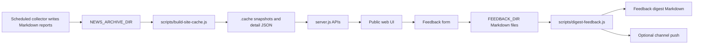

# Architecture

## Runtime Shape

Daily Tech Briefing Site has five small runtime surfaces:

- `server.js`: static site, JSON APIs, feedback intake, maintenance authorization.
- `src/report-parser.js`: parses Markdown briefing snapshots.
- `src/site-index.js`: builds and reads cache files.
- `src/feedback-store.js`: writes feedback as Markdown.
- `src/ops-store.js`: writes local maintenance logs and status JSON.

The project intentionally does not require a database. The durable source of truth is the user's report directory plus feedback and maintenance Markdown folders.

## Data Flow

## Optional Integrations

- OpenClaw is optional and only needed for channel push or advanced health checks.
- Feishu push is optional and requires `FEISHU_TARGET`.
- Cloudflare Tunnel is optional and requires `.env.tunnel`.
- qmd refresh is optional and requires `WIKI_SOURCE_DIR` plus `qmd`.

## Public Package Boundary

The public branch contains source code, examples, docs, and launchd templates. It does not contain:

- real runtime state,
- private tokens,
- installed LaunchAgents,
- local feedback,
- local maintenance logs,
- private report archives.
