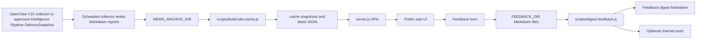

# Architecture

## Runtime Shape

Daily Tech Briefing Site has five small runtime surfaces:

- `server.js`: static site, JSON APIs, feedback intake, maintenance authorization.
- `src/report-parser.js`: parses Markdown briefing snapshots.
- `src/site-index.js`: builds and reads cache files.
- `src/feedback-store.js`: writes feedback as Markdown.
- `src/ops-store.js`: writes local maintenance logs and status JSON.

The project intentionally does not require a database. The durable source of truth is the user's report directory plus feedback and maintenance Markdown folders.

## Data Flow

```mermaid
flowchart LR
  A0["OpenClaw V10 collector or approved Intelligence Pipeline DeliverySnapshot"] --> A["Scheduled collector writes Markdown reports"]
  A --> B["NEWS_ARCHIVE_DIR"]
  B --> C["scripts/build-site-cache.js"]
  C --> D[".cache snapshots and detail JSON"]
  D --> E["server.js APIs"]
  E --> F["Public web UI"]
  F --> G["Feedback form"]
  G --> H["FEEDBACK_DIR Markdown files"]
  H --> I["scripts/digest-feedback.js"]
  I --> J["Feedback digest Markdown"]
  I --> K["Optional channel push"]
```

## Upstream Shadow Gates

The upstream OpenClaw Intelligence Pipeline is currently shadow-only. Its V10 parity snapshot parses the Markdown report contract consumed by `src/report-parser.js` and compares it with the shadow `DeliverySnapshot` shape.

Current gate state:

- Required V10 fields pass schema parity: `title`, `source`, `link`, `summary`.
- Optional score parity is still reported as missing.
- Synthesis now passes through a zero-network `fixture_canary` adapter with `model_profile_id=deepseek-v4-flash`.
- The live synthesis adapter is contract-only: timeout, cost, schema, and failure-mode audit fields exist, but network and model calls are disabled.
- The live canary execution gate can emit one fixture draft only under explicit switches, and remains inside the Synthesis Engine boundary.
- The provider adapter harness can replay recorded provider-shaped responses under explicit injection, parse them into `SynthesisDraft`, classify provider errors, and keep `network_used=false` plus `model_call_count=0`.
- The real provider canary guard now evaluates live-provider preflight policy, but still blocks before any actual provider adapter exists.
- The live provider transport stub defines a secret-free request/response envelope and timeout/error mapping while still using no real network or model call.
- The HTTP transport implementation contract shadow records endpoint, retry, secret resolver, and redline semantics while remaining fail-closed and network-free.
- The HTTP transport dry-run can produce a sanitized request plan, but still sends nothing and records no Authorization, key, prompt, article text, or source payload.
- The HTTP transport send shadow is default-off and only accepts an injected non-network fake client; response audit records status and field shape, not raw provider payload.
- Content parity remains blocked by `synthesis_adapter_not_live` and `delivery_snapshot_not_approved`.
- The site still consumes Markdown reports from `NEWS_ARCHIVE_DIR`; no shadow flow writes, publishes, or replaces V10.

## Optional Integrations

- OpenClaw is optional and only needed for channel push or advanced health checks.
- Feishu push is optional and requires `FEISHU_TARGET`.
- Cloudflare Tunnel is optional and requires `.env.tunnel`.
- qmd refresh is optional and requires `WIKI_SOURCE_DIR` plus `qmd`.

## Public Package Boundary

The public branch contains source code, examples, docs, and launchd templates. It does not contain:

- real runtime state,
- private tokens,
- installed LaunchAgents,
- local feedback,
- local maintenance logs,
- private report archives.
